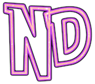

  

<!-- Title -->
<h1 align="center">
  ND - Novel Downloader

  

  
</h1>

<!-- description -->

  <strong>ND is a commandline tools for download novel from supported sources in parallel</strong>

<!-- Internal link -->
<h4 align="center">
  <a href="docs/Usecases.md">Usecases</a>
   · 
  <a href="docs/Business.md">Business</a>
   · 
  <a href="docs/Technical.md">Technical</a>
   · 
  <a href="docs/reports/CHANGELOG.md">Changelog</a>
   · 
  <a href="docs/reports/loc">Line of code</a>
</h4>

## Badges

This badge will represent informative of the repository

### Information

| Name         | Badge                                           |
| ------------ | ----------------------------------------------- |
| Avg. commit  | ![gh-avg-commit-monthly][gh-avg-commit-monthly] |
| Top language | ![gh-top-language][gh-top-language]             |
| Repo size    | ![gh-repo-size][gh-repo-size]                   |
| Code size    | ![gh-code-size][gh-code-size]                   |

### Test and Coverage

| Name     | Badge                                        |
| -------- | -------------------------------------------- |
| Unittest | [![circleci][circleci-badge]][circleci-link] |
| Coverage | [![codecov][codecov-badge]][codecov-link]    |

### Analytic and Security

| Name            | Badge                                                             |
| --------------- | ----------------------------------------------------------------- |
| Quality gate    | [![sonar-qg][sonar-qg-badge]][sonar-link]                         |
| Duplication     | [![sonar-dup][sonar-dup-badge]][sonar-dup-link]                   |
| Maintainability | [![sonar-maintain][sonar-maintain-badge]][sonar-maintain-link]    |
| Reliability     | [![sonar-rel][sonar-rel-badge]][sonar-rel-link]                   |
| Security        | [![sonar-secure][sonar-secure-badge]][sonar-secure-link]          |
| Technival Debt  | [![sonar-tech-debt][sonar-tech-debt-badge]][sonar-tech-debt-link] |
| Violations      | [![sonar-violation][sonar-violation-badge]][sonar-link]           |
| Vulnerabilities | [![snyk][snyk-badge]][snyk-link]                                  |

### Dependencies

| Name                 | Badge                                           |
| -------------------- | ----------------------------------------------- |
| Dependencies         | [![david][david-badge]][david-link]             |
| Develop Dependencies | [![david-dev][david-dev-badge]][david-dev-link] |

[gh-avg-commit-monthly]: https://img.shields.io/github/commit-activity/m/kamontat/nd?label=activity&logo=github&logoColor=white&style=flat-square
[gh-top-language]: https://img.shields.io/github/languages/top/kamontat/nd?logo=github&logoColor=white&style=flat-square
[gh-repo-size]: https://img.shields.io/github/repo-size/kamontat/nd?logo=github&logoColor=white&style=flat-square
[gh-code-size]: https://img.shields.io/github/languages/code-size/kamontat/nd?logo=github&logoColor=white&style=flat-square
[circleci-badge]: https://img.shields.io/circleci/build/github/kamontat/nd?logo=circleci&logoColor=white&style=flat-square
[circleci-link]: https://circleci.com/gh/kamontat/workflows/nd
[codecov-badge]: https://img.shields.io/codecov/c/github/kamontat/nd?logo=codecov&logoColor=white&style=flat-square
[codecov-link]: https://codecov.io/gh/kamontat/nd
[snyk-badge]: https://img.shields.io/snyk/vulnerabilities/github/kamontat/nd?logo=snyk&logoColor=white&style=flat-square
[snyk-link]: https://app.snyk.io/org/kamontat/project/a5bcf3c4-23ce-43c3-8afe-b63b690252f2
[david-badge]: https://img.shields.io/david/kamontat/nd?style=flat-square
[david-link]: https://david-dm.org/kamontat/nd
[david-dev-badge]: https://img.shields.io/david/dev/kamontat/nd?style=flat-square
[david-dev-link]: https://david-dm.org/kamontat/nd?type=dev
[sonar-qg-badge]: https://sonarcloud.io/api/project_badges/measure?project=kamontat_nd&metric=alert_status
[sonar-link]: https://sonarcloud.io/dashboard?id=kamontat_nd
[sonar-dup-badge]: https://sonarcloud.io/api/project_badges/measure?project=kamontat_nd&metric=duplicated_lines_density
[sonar-dup-link]: https://sonarcloud.io/component_measures?id=kamontat_nd&metric=Duplications&view=list
[sonar-maintain-badge]: https://sonarcloud.io/api/project_badges/measure?project=kamontat_nd&metric=sqale_rating
[sonar-maintain-link]: https://sonarcloud.io/component_measures?id=kamontat_nd&metric=Maintainability&view=list
[sonar-rel-badge]: https://sonarcloud.io/api/project_badges/measure?project=kamontat_nd&metric=reliability_rating
[sonar-rel-link]: https://sonarcloud.io/component_measures?id=kamontat_nd&metric=Reliability&view=list
[sonar-secure-badge]: https://sonarcloud.io/api/project_badges/measure?project=kamontat_nd&metric=security_rating
[sonar-secure-link]: https://sonarcloud.io/component_measures?id=kamontat_nd&metric=Security&view=list
[sonar-tech-debt-badge]: https://sonarcloud.io/api/project_badges/measure?project=kamontat_nd&metric=sqale_index
[sonar-tech-debt-link]: https://sonarcloud.io/component_measures?id=kamontat_nd&metric=sqale_index&view=list
[sonar-violation-badge]: https://img.shields.io/sonar/violations/kamontat_nd?format=long&server=https%3A%2F%2Fsonarcloud.io&style=flat-square
